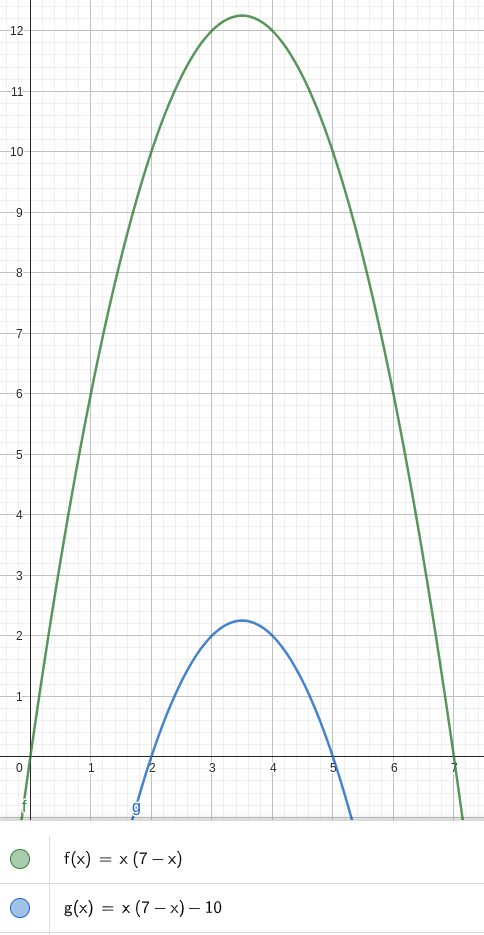

distance = charge_time * (time_limit - charge_time)

if we reduce this quadratic equation by the distance needed to win, we can use the quadratic formula to solve for the roots

This graph shows the distance traveled by how long the button is held in green, and a reduced parabola in green where y=0 is the min/max button hold time to win

charge_time * (time_limit - charge_time) - minimum_distance

-charge_time^2 + time_limit*charge_time - minimum_distance

in the first example, the race time limit is 7 and current winning distance is 9, so we need 10 to win.

-x^2 + 7x - 10

roots = (-b (+ or -) sqrt(b**2 - 4*a*c)) / 2*a

the difference between these roots multiplied by the roots of the other races is the solution to part 1

part 2 is even easier, its just the difference between the roots of one race.
